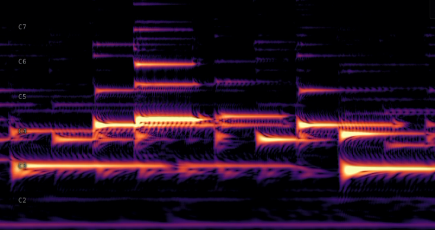

# resonato**rs**

A Rust implementation of Alexandre François's [Resonate algorithm][paper] for low-latency spectral analysis, with Python and WebAssembly bindings.

[](https://crates.io/crates/resonators)
[](https://pypi.org/project/resonators/)
[](https://www.npmjs.com/package/resonators)
[](https://docs.rs/resonators)
[](https://github.com/jhartquist/resonators/actions/workflows/ci.yml)
[](#license)

[resonate]: https://alexandrefrancois.org/Resonate/
[paper]: https://alexandrefrancois.org/assets/publications/FrancoisARJ-ICMC2025.pdf
[talk]: https://www.youtube.com/watch?v=QbNPA5QJ6OU
[nofft]: https://github.com/alexandrefrancois/noFFT

## What it is

This project implements Alexandre François's [Resonate algorithm][resonate] for computing spectral representations of an input signal. It produces outputs similar to STFT or CQT, with per-sample updates and no windowing or buffering. Internally, it's a bank of independent resonators (conceptually phasor-like oscillators) each tuned to a fixed frequency and accumulating the input's contribution via an exponentially weighted moving average. Because every resonator has its own frequency and its own time constant, you get per-bin control over the time-frequency tradeoff.

It's based on Alexandre's reference implementation, [noFFT][nofft], which is written in C++ and depends on Apple's Accelerate framework (macOS/iOS only). I created this to generate features for training ML models in Python and for inference in the browser via WASM. Writing it in Rust allows for portable SIMD and consistent numerical results across platforms.

## When to use it

**Good for:**

- Real-time use where latency matters more than absolute frequency resolution
- Fixed memory footprint, independent of signal length
- Custom frequency layouts or per-bin time constants (non-uniform time-frequency resolution)

**Not the right tool for:**

- General-purpose STFT or CQT analysis: use [librosa](https://librosa.org/) or similar
- Offline batch where FFT's O(N log N) per frame is fine

## Demo



*[Try it in your browser](https://jhartquist.github.io/resonators/spectrogram/).*

Live in the browser:

- [**Spectrogram**](https://jhartquist.github.io/resonators/spectrogram/): feed your mic through a resonator bank in real time
- [**Benchmark**](https://jhartquist.github.io/resonators/bench/): run the WASM bank in your browser

## Install

Rust:

```sh
cargo add resonators
```

Python:

```sh
pip install resonators
```

JavaScript:

```sh
npm install resonators
```

## Quickstart

Rust:

```rust
use resonators::ResonatorBank;
use std::f32::consts::PI;

let sample_rate = 44_100.0;
let freqs = [110.0, 220.0, 440.0, 880.0];
let mut bank = ResonatorBank::from_frequencies(&freqs, sample_rate);

let signal: Vec<f32> = (0..sample_rate as usize)
    .map(|i| (2.0 * PI * 440.0 * i as f32 / sample_rate).sin())
    .collect();
let spectrogram = bank.resonate(&signal, 256); // flat Vec<Complex32>, (n_frames, n_bins)
```

Python:

```python
import numpy as np
from resonators import ResonatorBank

sample_rate = 44_100.0
freqs = np.array([110, 220, 440, 880], dtype=np.float32)
bank = ResonatorBank(freqs, sample_rate)  # alphas default to a per-frequency heuristic

t = np.arange(sample_rate, dtype=np.float32) / sample_rate
signal = np.sin(2 * np.pi * 440.0 * t).astype(np.float32)
spectrogram = bank.resonate(signal, hop=256)  # shape (n_frames, n_bins), complex64
```

JavaScript:

```javascript
import init, { ResonatorBank } from "resonators";
await init();

const sampleRate = 44100;
const freqs = new Float32Array([110, 220, 440, 880]);
const bank = new ResonatorBank(freqs, sampleRate);

const signal = new Float32Array(sampleRate);
for (let i = 0; i < signal.length; i++) {
  signal[i] = Math.sin(2 * Math.PI * 440 * i / sampleRate);
}
const spectrogram = bank.resonate(signal, 256); // Float32Array, interleaved [re, im, ...]
```

## Benchmarks

Throughput of `bank.resonate(signal, hop)` measured against [noFFT][nofft] (installed from PyPI). noFFT uses Apple's Accelerate framework under the hood.

| Bins | Hop | resonators | noFFT | ratio |
|------|-----|------------|-------|-------|
| 88  | 256 | 23.88 M/s | 14.98 M/s | 1.59× |
| 264 | 256 |  8.89 M/s |  5.49 M/s | 1.62× |
| 440 | 256 |  5.44 M/s |  3.42 M/s | 1.59× |
| 880 | 256 |  2.80 M/s |  1.73 M/s | 1.62× |

- Measured on Apple M2 Max, compiled with `-C target-cpu=native`.
- Reproduce with `uv run scripts/benchmark.py`.
- On other platforms, `cargo bench --bench bank` measures per-sample throughput.

## Credits

The Resonate algorithm is by **Alexandre R. J. François**.

- [Project page][resonate]
- Paper: *Resonate: Efficient Low Latency Spectral Analysis of Audio Signals* ([ICMC 2025 Best Paper][paper])
- [ADC talk][talk]: *Real-Time, Low Latency and High Temporal Resolution Spectrograms*
- Reference implementation: [noFFT][nofft] (C++, Apple Accelerate)

## License

Dual-licensed under [MIT](LICENSE-MIT) or [Apache-2.0](LICENSE-APACHE), at your option.
